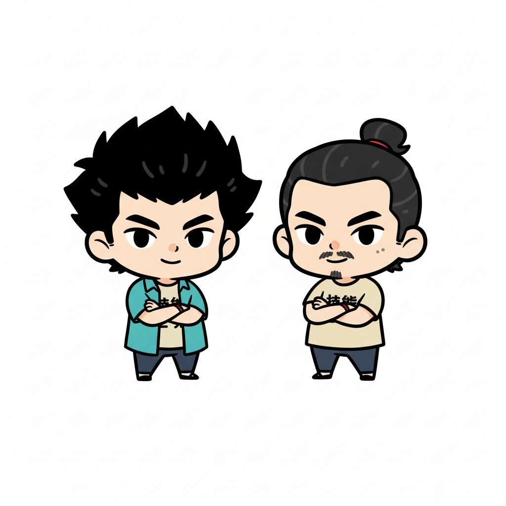
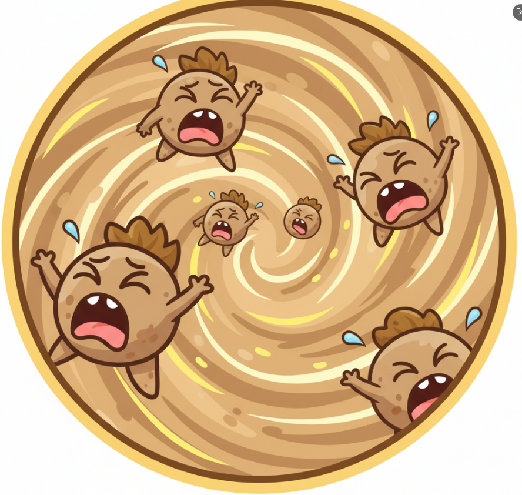
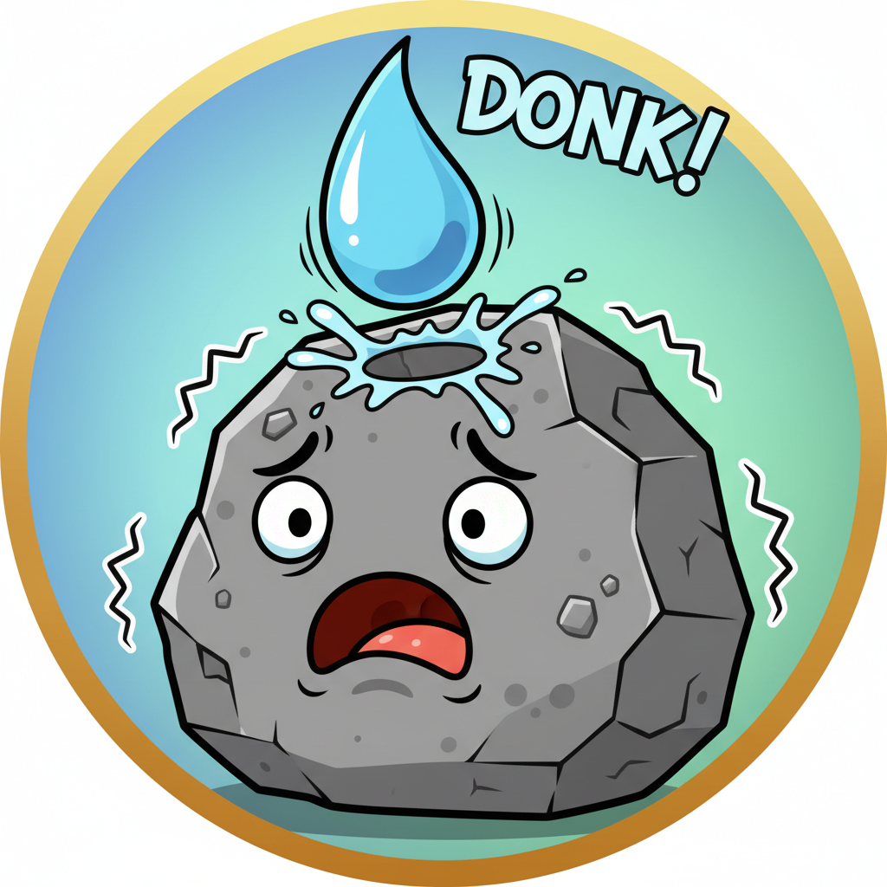
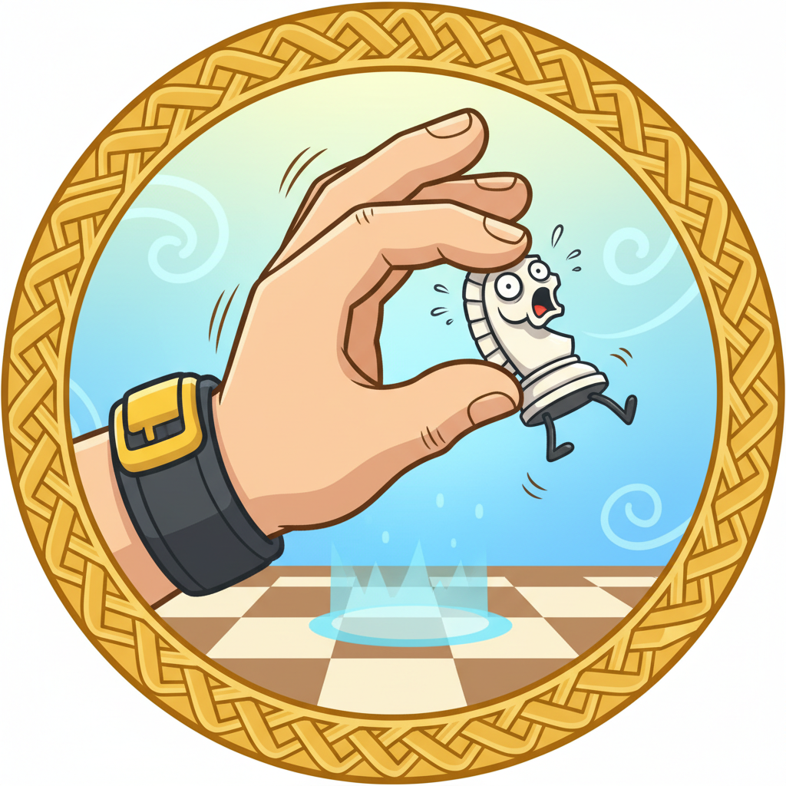
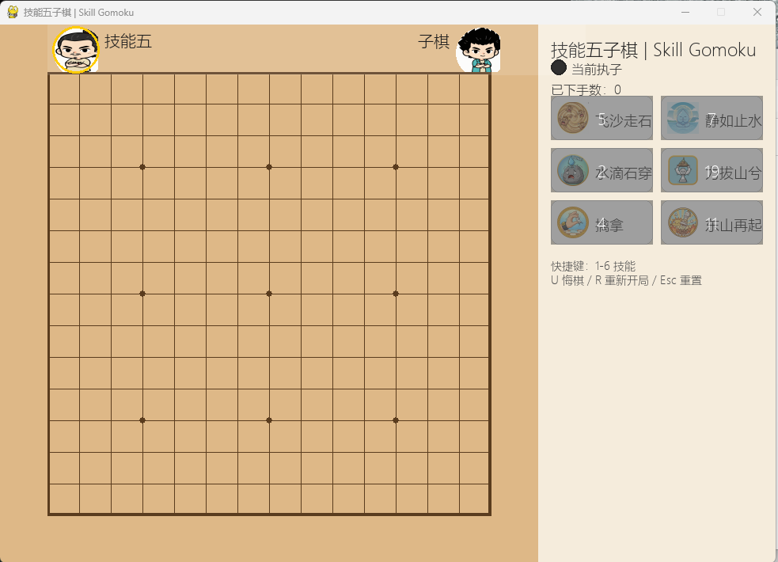

# 技能五子棋 · Skill Gomoku  
**《喜人奇妙夜2》灵感改编 / Inspired by “Xiren’s Wonderful Night 2”**

> 原作品视频（Tencent Video）/ Original show clip:  
> https://v.qq.com/x/cover/mzc002004l7dytn/c4101w281aj.html
---

## 玩家头像 · Player Avatars

<p align="center">
  
</p>

## 技能图标 · Skill Icons

<table>
  <tr>
    <td align="center">
      <br/>
      <sub>1. 飞沙走石</sub>
    </td>
    <td align="center">
      <br/>
      <sub>2. 静如止水</sub>
    </td>
    <td align="center">
      <br/>
      <sub>3. 水滴石穿</sub>
    </td>
  </tr>
  <tr>
    <td align="center">
      <br/>
      <sub>4. 力拔山兮</sub>
    </td>
    <td align="center">
      <br/>
      <sub>5. 擒拿</sub>
    </td>
    <td align="center">
      <br/>
      <sub>6. 东山再起</sub>
    </td>
  </tr>
</table>

---

## 游戏截图 · In-game Screenshot

<p align="center">
  
</p>

---

## 概述 · Overview

**中文**  
这是综艺节目《喜人奇妙夜2》中“技能五子棋”的一个**非官方**实现。为增强可玩性与清晰度，本项目在原设定基础上做了若干扩展：加入技能冷却、UI 信息面板、头像与消息提示、冻结反应窗口、重开对话框等。使用 **Python + Pygame** 实现，并可通过可执行文件 **`SkillGomoku.exe`** 直接游玩。

**English**  
This is an **unofficial** implementation of “Skill Gomoku” from the variety show *Xiren’s Wonderful Night 2*. To improve playability and clarity, this build adds quality-of-life features: skill cooldowns, an info panel, avatars & message feed, a freeze reaction overlay, and a rematch dialog. Built with **Python + Pygame**, with a packaged **`SkillGomoku.exe`** available when provided.

---

## 玩法速览 · How to Play

**基本规则 / Base Rules**
- **棋盘 Board**：15×15，黑先 Black goes first.  
- **落子 Place**：鼠标左键点击交点空位 Left-click an empty intersection.  
- **胜负判定 Win**：任意一方连成五子即胜 Five in a row wins；棋盘满为平局 Full board → draw.  

**回合流程 / Turn Flow**
1. **回合开始 Start**：当前玩家技能冷却回合数 −1（不少于 0）；清除自己上回合布下的“擒拿”。  
2. **技能阶段 Skill Phase**：落子前可释放技能（除“水滴石穿”为冻结回合的反应技）。  
3. **落子阶段 Place**：若未被冻结，正常落子并立即判胜/和。  
4. **切换回合 Switch**：更换执子方，进入对手的回合开始。  

**技能与热键 / Skills & Hotkeys**

| # | 技能 Skill | Hotkey | 时机 Timing | 效果 Effect | 冷却 CD（自回合数） |
|---|---|---|---|---|---|
| 1 | **飞沙走石** Fly Sand | `1` | 落子前 Before placing | 进入“目标选择”，点击对方任意一枚棋子将其移除 Enter target-select to remove an opponent stone | 6 |
| 2 | **静如止水** Still Water | `2` | 落子前 Before placing | 令对手**下一回合冻结**（跳过落子） Freeze opponent on their next turn | 8 |
| 3 | **水滴石穿** Drip Stone | `3` | **仅在自己被冻结的回合开始** Only at start of your frozen turn | **解除本次冻结**，当回合可正常落子 Remove freeze and place normally | 3 |
| 4 | **力拔山兮** Mighty Power | `4` | 落子前（前置：总落子 ≥ 20） Before placing (≥20 total moves) | 以成功率**直接判胜**：基础 10%，活三/活四加成，上限 18% Instant win by chance (10% base + patterns up to 18%) | 20 |
| 5 | **擒拿** Qinna | `5` | 落子前 Before placing | 对手下回合**首次技能**直接无效 First skill opponent casts next turn is nullified | 5 |
| 6 | **东山再起** Comeback | `6` | 落子前 Before placing | 发起**重开**请求；对手同意则立即新对局 Request rematch; if accepted, restart | 12 |

> **拦截规则 Intercept**：若对手上回合施放了**擒拿(5)**，你在其回合内**首次发动的任意技能**会被直接无效并进入冷却。  
> **冻结提示 Freeze Hint**：当轮到被冻结方时，棋盘出现半透明提示层——按 **3** 解除，或点击棋盘任意处直接**跳过本回合**。

**其它快捷键 / Other Keys**
- `U`/`Z`：悔棋一步 Undo last move（不换边 no side switch）  
- `R`：重新开局 Restart  
- `Esc`：重置/返回 Reset/Back  
- 数字键 `1–6`：六个技能 Skills

---

## 运行方式 · Run the Game

### 方式 A：直接运行可执行文件 · Double-click the EXE (Recommended)
- 直接双击 **`SkillGomoku.exe`** 即可启动。  
- 若双击无反应：请右键 **以管理员身份运行**，并确认 `SkillGomoku.exe` 与 `assets/` 资源文件夹处于同一目录。

### 方式 B：源码运行 · Run from Source
**环境要求 / Requirements**
- Python **3.10+**  
- `pygame` **2.5+**（建议 2.6.x）

**安装 / Install**
```bash
# 进入项目目录 / Go to project root
cd SkillGomoku

# 如有 requirements.txt / If requirements.txt exists
pip install -r requirements.txt

# 否则直接安装 Pygame / Or install Pygame directly
pip install pygame
```

**启动 / Run**
```bash
python main.py
```

---

## 目录结构 · Project Structure

```
SkillGomoku/
├─ assets/                         # 资源 Assets
│  ├─ avatar_skillwu.png           # 黑方头像 Black avatar (optional)
│  ├─ avatar_ziqi.png              # 白方头像 White avatar (optional)
│  ├─ icon_fly_sand.png            # 技能图标 Skill icons (optional)
│  ├─ icon_still_water.png
│  ├─ icon_drip_stone.png
│  ├─ icon_mighty_power.png
│  ├─ icon_qinna.png
│  └─ icon_comeback.png
├─ config.py
├─ engine.py
├─ skills.py
├─ rules.py
├─ models.py
├─ utils.py
├─ ui.py
└─ main.py
```

> 头像/图标缺失时将自动使用占位渲染，不影响游戏；你可替换 `assets/` 下的文件来自定义风格。  
> If avatars/icons are missing, placeholders are drawn; feel free to customize by replacing files under `assets/`.

---

## 界面要点 · UI Highlights

- **顶部头像条 Top Avatar Bar**：当前执子方头像外圈高亮；找不到头像文件时显示棋子风格圆点。  
- **右侧信息面板 Right Panel**：标题、当前手（小圆棋子）、已下手数、技能按钮（带冷却遮罩与剩余回合数）、快捷键提示、最近 3 条消息；冻结/擒拿/重开请求时显示**状态文字**。  
- **棋盘细节 Board Details**：边框加粗、星位与天元；棋子带黑边；**最后一手**以黄色小框高亮；施放“飞沙走石”时，对方可选目标以黄色框指示。  
- **交互提示层 Overlays**：冻结遮罩、重开对话框（同意/拒绝）。  

---

## 常见问题 · FAQ

- **Q：点击技能没反应？ / Skill button not working?**  
  A：多数技能只能在**你方回合且落子前**释放；若已落子则本回合不能再放。仅“水滴石穿(3)”在**冻结回合开始**时可用。再查看右侧消息区：可能在**冷却中**，或被对手的“擒拿(5)”**拦截**。

- **Q：中文显示为方块？ / Garbled Chinese text?**  
  A：UI 会自动匹配系统中文字体；若系统缺少中文字体，可将任一中文字体（如 `NotoSansSC-Regular.otf`）放入 `assets/fonts/`，并在 `config.py` 的 `get_config()` 中设置 `"FONT_PATH"` 指向该文件。

- **Q：资源不显示或路径报错？ / Missing assets or path errors?**  
  A：请确认 `assets/` 与可执行文件/源码在**同一层级**，并检查文件名大小写与后缀是否一致。  

---

## 声明 · Disclaimer

- 本项目为**粉丝向**学习与交流目的的实现，非官方版本；与节目《喜人奇妙夜2》及相关版权方**无关**。  
- 原节目片段链接（腾讯视频）/ Original clip: https://v.qq.com/x/cover/mzc002004l7dytn/c4101w281aj.html  
- 项目中所有外部素材（头像、图标、字体等）版权归其各自权利人所有；如用于发布或商业用途，请自行更换或获得授权。  
- This project is **fan-made** for educational/demo purposes and is **not affiliated** with the original show or rights holders. All third-party assets belong to their respective owners.

---

## 开源协议 · License

- 代码部分可按 Apache-2.0 等常见许可分发。  
- The source code may be distributed under a permissive license (e.g., MIT/Apache-2.0). 

---

## 鸣谢 · Credits

- 综艺节目《喜人奇妙夜2》“技能五子棋”的创意灵感  
- Pygame 社区 / Pygame Community: https://www.pygame.org/contribute.html

---

## 联系与反馈 · Contact

欢迎提交 Issue 或反馈建议，建议附上：系统版本、Python/Pygame 版本、运行方式（EXE 或源码）与复现步骤。  
Issues and suggestions are welcome — please include OS, Python/Pygame versions, run method (EXE or source), and repro steps.

祝你玩得开心！Have fun 🕹️
